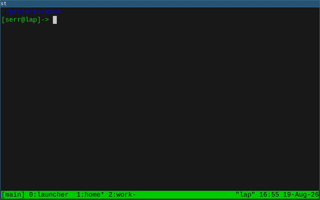

# mado — markdown organizer

A command-line tool that stores entries (tasks, notes) as markdown
files and supports powerful filtering with a query language



## Table of Contents

- [Features](#features)
- [Usage Example](#usage-example)
- [Customizing Templates](#customizing-templates)
- [Sorting Entries](#sorting-entries)
- [Output Formats](#output-formats)
- [Query Syntax](#query-syntax)
  - [Operators](#operators)
  - [Logical Operators](#logical-operators)
  - [Types](#types)
  - [Keywords](#keywords)
  - [Macros](#macros)
- [Installation](#installation)
- [Performance](#performance)
- [Interfaces](#interfaces)
  - [Emacs interface](#emacs-interface)
- [Requirements](#requirements)
- [Inspiration](#inspiration)

## Features

- **Per-project isolation**: Each project has its own `MADO/`
  directory, similar to `.git` — no global directories are used. This
  allows you to version‑control `MADO/` alongside your code
- **Entry storage**: Entries stored as `MAIN.md` files in timestamped
  directories (`YYYYMMDDTHHMMSS/MAIN.md`) in `MADO/` directory. The
  entry directory can also contain any additional files related to the
  entry — attachments, screenshots, logs, scripts, etc. Everything
  stays organized in one place

## Usage Example

Start from scratch in a new project:

``` bash
# Create a project directory and enter it
mkdir myproject
cd myproject

# Initialize MADO directory (like git init)
mado init
```

Once the `MADO/` directory is initialized, you can work with entries
from any subdirectory within the project — just like Git, mado
automatically finds the nearest `MADO/` directory by walking up the
file tree

``` bash
# Create your first entry
mado new
```

The entry will be created with the following content:

```
- NAME:
- PRIORITY:
- TAGS:
- STATUS:
- DEADLINE:
```

You can fill it out as needed, for example:

```
- NAME: Fix login bug
- PRIORITY: 10
- TAGS: bug, critical, auth
- STATUS: opened
- DEADLINE: 20260615

The login page returns 500 error when using special characters.
...
```

> No fields are required — you can omit any field entirely or leave its value empty. For example, when writing a note, you probably won't need the priority, status and deadline fields.
> When a field is omitted or left empty:
> - NAME, STATUS default to empty string ""
> - PRIORITY defaults to 0
> - DEADLINE defaults to 99990101T000000
> - TAGS defaults to a list with one empty string [""]
> - PATH is a system field, always present and set to the full path of the entry's MAIN.md file. It cannot be changed or removed manually
> - TIME is a system field, always present and set to the entry's directory name (creation timestamp in YYYYMMDDTHHMMSS format). It cannot be changed or removed — it reflects when the entry was created
> - MTIME is a system field, automatically set to the modification time of the entry's file (YYYYMMDDTHHMMSS format). It updates whenever the entry file changes and cannot be manually edited

When you have many entries, you'll want to filter them:

``` bash
# List all entries
mado list 'all'

# Find critical bugs
mado list 'tag = bug and priority > 5'

# Delete low priority entries
mado remove 'priority < 5'

# Filter by entry name (exact match)
mado list 'name = login'

# Filter by entry name (substring)
mado list 'name ~ login'
mado list 'name ~ "fix login"' # multiple words — quotes required

# Filter by entry name (fuzzy match)
mado list 'name ~~ "fx lgn b"' # Finds "Fix login bug"
mado list 'name !~~ lgn' # Entries that do NOT fuzzy match

# Filter by creation time
mado list 'time ~ 20260516' # Entries created on 2026-05-16
mado list 'time > 20260516T12' # Entries created after 2026-05-16 12:00:00
mado list 'time > 2023 and time < @year+1' # Entries created between 2023 and current year (inclusive)

# Find entries with complex conditions
mado list '(tag = bug or tag = critical) and status = opened and deadline < @now'
mado list 'not (priority < 3 or status = closed)'
mado list '(priority > 5 and tag = urgent) or status = reopened'

# Syntactic sugar for matching multiple values
mado list 'status = anyof(opened, reopened)' # Status equals "opened" OR "reopened"
mado list 'priority = anyof(10, 20, 30)' # Priority equals 10 OR 20 OR 30
mado list 'tag = allof(bug, critical)' # Entry has BOTH "bug" AND "critical" tags

# Sort results
mado list -s +priority 'tag = bug' # bugs sorted by priority
mado list -s -priority,+time 'all' # highest priority first, oldest first
```

## Customizing Templates

Templates are stored in `MADO/.templates/` as markdown files:

``` bash
# Create a bug report template
cat > MADO/.templates/bug.md << 'EOF'
- NAME:
- PRIORITY: 10
- TAGS: bug
- STATUS: opened

## Steps to Reproduce
1.

## Expected Behavior

## Actual Behavior
EOF
```

You can create entries with custom templates:

``` bash
mado new -t bug
# The template must exist at: MADO/.templates/bug.md
```

## Sorting Entries

The `-s` / `--sort` flag allows you to sort entries by one or more fields:

``` bash
# Sort by priority (ascending by default)
mado list -s priority 'all'

# Sort by priority descending
mado list -s -priority 'all'

# Sort by multiple fields (priority ascending, then time descending)
mado list -s +priority,-time 'all'

# Sort by status, then name
mado list -s status,name 'all'
```

Sort order:

- `+field` or `field` — ascending order (default)
- `-field` — descending order

## Output Formats

The `-f` flag controls how entries are displayed:

``` bash
# Default format: path:1: fields
mado list 'all'
# Compatible with Emacs compile buffer and other tools that parse file:line:

# Paths only — useful for piping to other tools
mado list -f path 'all'
# Search across entry bodies with grep
grep 'match' $(mado list -f path 'all')

# Newline-delimited JSON for scripts
mado list -f jsonl 'all'

# Pipe JSON output to jq for advanced processing
mado list -f jsonl 'priority > 5' | jq '.name'
mado list -f jsonl 'all' | jq -s 'group_by(.status)'
mado list -f jsonl 'all' | jq -s 'sort_by(.priority)'
```

## Query Syntax

The query language supports filtering entries using operators and
keywords

### Operators

| Operator | Description | Note |
|----------|-------------|------|
| `>` | Greater than | For string/timestamp: lexicographic |
| `<` | Less than | For string/timestamp: lexicographic |
| `>=` | Greater than or equal | For string/timestamp: lexicographic |
| `<=` | Less than or equal | For string/timestamp: lexicographic |
| `=` | Equal / exact match | |
| `!=` | Not equal | |
| `~` | Contains | For numbers: alias for `=` |
| `!~` | Not contains | For numbers: alias for `!=` |
| `~~` | Fuzzy match | For numbers: alias for `=` |
| `!~~` | Not fuzzy match | For numbers: alias for `!=` |

### Logical Operators

| Operator | Description |
|----------|-------------|
| `and` | Logical AND |
| `or` | Logical OR |
| `not` | Logical NOT |

### Types

| Type | Description | Format | Examples |
|------|-------------|--------|----------|
| **number** | Integer value | 0-999 | `0`, `10`, `999` |
| **string** | Text value | Unquoted: `[a-zA-Z_][a-zA-Z0-9_-]*` or quoted: `"..."` or `'...'` | `bug`, `"fix login"`, `'проблема'` |
| **timestamp** | Timestamp value | Subset of ISO 8601: `YYYYMMDDTHHMMSS` with optional shorter forms: `YYYY`, `YYYYMM`, `YYYYMMDD`, `YYYYMMDDT`, `YYYYMMDDTHH`, `YYYYMMDDTHHMM`, `YYYYMMDDTHHMMSS` | `2026`, `202605`, `20260516`, `20260516T`, `20260516T12`, `20260516T1230`, `20260516T123012` |

### Keywords

| Keyword | Type    | Operators                      | Example                           |
|---------|---------|--------------------------------|-----------------------------------|
| `priority` | number | `>`, `<`, `>=`, `<=`, `=`, `!=`, `~` (alias for `=`), `!~` (alias for `!=`), `~~` (alias for `=`), `!~~` (alias for `!=`) | `priority > 5`, `priority != 10` |
| `tag`      | string  | `>`, `<`, `>=`, `<=`, `=`, `!=`, `~`, `!~`, `~~`, `!~~`           | `tag = bug`, `tag ~ crit` |
| `status`   | string  | `>`, `<`, `>=`, `<=`, `=`, `!=`, `~`, `!~`, `~~`, `!~~`           | `status = opened`, `status ~ ope` |
| `name`     | string  | `>`, `<`, `>=`, `<=`, `=`, `!=`, `~`, `!~`, `~~`, `!~~`           | `name = "Fix bug"`, `name ~~ "fx lgn"` |
| `path`     | string  | `>`, `<`, `>=`, `<=`, `=`, `!=`, `~`, `!~`, `~~`, `!~~`           | `path ~ "/home/user/projects"` |
| `time`     | timestamp  | `>`, `<`, `>=`, `<=`, `=`, `!=`, `~`, `!~`, `~~`, `!~~`           | `time > 20260505T1230 and time < 20260510T` |
| `mtime`     | timestamp  | `>`, `<`, `>=`, `<=`, `=`, `!=`, `~`, `!~`, `~~`, `!~~`           | `mtime > 20260505T1230` |
| `deadline`     | timestamp  | `>`, `<`, `>=`, `<=`, `=`, `!=`, `~`, `!~`, `~~`, `!~~`           | `deadline > 20260505T1230 and deadline < 20260510T` |
| `all`      | special | -                              | `all`                  |

> **Note:** all operators also work with `anyof(...)` and `allof(...)`.
> These are syntactic sugar that expand to multiple conditions.
> `anyof(...)` expands with `or`, `allof(...)` expands with `and`.
> Examples:
> - `status = anyof(opened, reopened)` is equivalent to `status = opened or status = reopened`
> - `tag ~ allof(bug, crit, fix)` is equivalent to `tag ~ bug and tag ~ crit and tag ~ fix`

### Macros

Macros start with `@` and are resolved at parse time — the value is
substituted before the AST is evaluated

#### Time Macros

Resolve to timestamps. Accept optional offsets with `+`/`-`

| Macro | Resolution | Offset unit |
|-------|-----------|-------------|
| `@now` | Current timestamp (`YYYYMMDDTHHMMSS`) | days |
| `@today` | Today (`YYYYMMDD`) | days |
| `@yesterday` | Yesterday (`YYYYMMDD`) | days |
| `@tomorrow` | Tomorrow (`YYYYMMDD`) | days |
| `@week` | Current week monday (`YYYYMMDD`) | weeks |
| `@month` | Current month (`YYYYMM`) | months |
| `@year` | Current year (`YYYY`) | years |
| `@never` | 99990101T000000 | days |

Examples:

``` bash
mado list 'deadline > @week'
mado list 'deadline > @year'
mado list 'time > @today-4'
mado list 'time >= @week-1'
mado list 'deadline < @today+30'
mado list 'time ~ @month-2'
mado list 'mtime > @now-1'
mado list 'deadline != @never' # entries with non-default deadline
```

#### Number Macros

Resolve to numeric values

| Macro | Value |
|-------|-------|
| `@max` | 999 |
| `@min` | 0 |

Examples:

``` bash
mado list 'priority = @max' # highest priority entries
mado list 'priority = @min' # lowest priority entries
```

## Installation

Clone the repository and build:

``` bash
make
```

If your standard library requires TBB for parallel algorithms, build
with:

``` bash
make USE_TBB=1
```

This will produce an executable file `./mado`

## Performance

Time to list `100,043` entries with filter query: `~3.5s`

Time to list `100,043` entries with filter query and `--parallel`
mode: `~1.3s`

> **Note:** benchmarked on AMD Ryzen 5 5600H (6 cores, 12 threads,
> 3.30 GHz base) with NVMe SSD

> **Note 2:** Performance can be improved by hiding unnecessary
> fields. For example, hiding `mtime` (`--hide-mtime`) eliminates one
> `stat()` system call per entry file, reducing I/O overhead

Time to list `100,043` entries with filter query, `--parallel` mode
and `--hide-mtime`: `~1s`

## Interfaces

`mado` is designed as a backend that can power different
frontends. The core is a fast C++ engine with a query language, while
interfaces handle display and interaction

### Emacs interface

[emado](https://github.com/laserattack/emado) provides a pretty Emacs
interface with transient menus, interactive statistics, outline-mode
sections, direct deletion from the buffer, etc


## Requirements

- **Linux system**
- **Build dependencies**:
  - C compiler
  - C++ compiler (TBB may be required depending on the standard
    library implementation — see [Installation](#installation))
  - `make`
  - `flex`
  - `bison`

## Inspiration

Inspired by [Tsoding's video on building a query language
compiler](https://youtu.be/8NdRGmp70Go)
